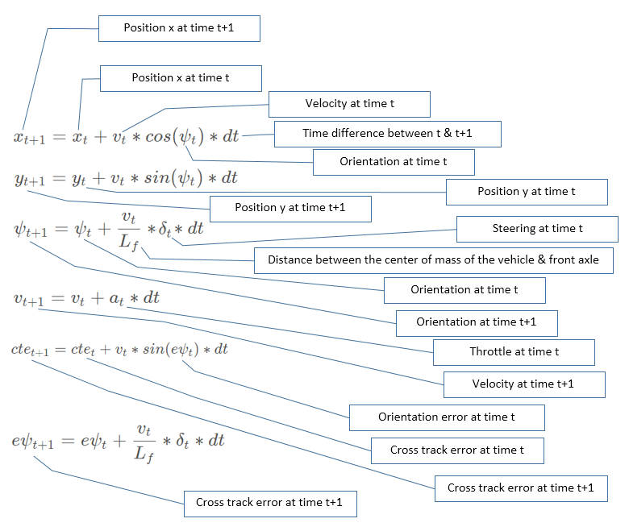

# Project: Model Predictive Control (MPC)
## Overview
This project is about using [Model Predictive Control (MPC)](https://en.wikipedia.org/wiki/Model_predictive_control) for controlling car steering angle & throttle.


## How Does It Work?

The MPC reframes the task of following a trajectory to an optimization problem by finding the best combination of steering angle & throttle values . The MPC is fed the initial state of the car [position, orientation, velocity, cross track error, orientation error]. Using the [Kinematic](https://en.wikipedia.org/wiki/Kinematics) vehicle model, actuator limitations and a cost function, the MPC then predicts the best possible actuator inputs (steering & throttle) by finding the lowest cost trajectory. 

## Rubric Points

### The Model

The MPC is based on the global Kinematic Model that is a simple real-time model easily applicable to different types of vehicle and accuracy wise is as good as its complex counterparts. It uses the current state of the car [position, orientation, velocity, cross track error, orientation error] and the actuator values [steering angle, throttle] for making future state & actuator predictions. Below are the equations that define the model:



Following steps illustrate the workings of the MPC:

1. Transform waypoints (provided by the simulator) from global co-ordinate system to vehicle co-ordinate system.
2. Fit a polynomial of order 3 to the transformed waypoints.
3. Calculate initial cross track & orientation errors.
4. Get the state after 100 ms & use the calculated state as current state to account for actuator latency.
5. Call the MPC solver.
6. Get the computed actuator values & the MPC predicted trajectory.  


### Timestep Length and Elapsed Duration (N & dt)

In MPC, the `T` is the *prediction horizon* in seconds, which is a product of *no. of timesteps* `N` and the *duration between each timestep* `dt`. Decreasing *dt* increases the frequency of actuation (the number of times steering & throttle is adjusted), which although results in a smoother trajectory e.g. in case of making a left or right turn, the computational cost increases and vice-versa. In case of *N*, an increase results in a large horizon meaning that the predictions are made for a longer time period. Setting a higher number means that it not only becomes computationally taxing but also somewhat a waste of computational resources as the car might not even maintain that trajectory due to changing environmental factors. Also depending upon *dt*, looking that far ahead might not be helpful if the trajectory is recomputed & gets changed with each timestep.

I tried different combinations of *N* & *dt* and in the end settled for values of `N=10` and `dt=0.1`. The table below shows the results of some of other combination of values:

| N | dt | Description   		| 
|:---:|:---:|:-------------------------------| 			
| 10 | 0.05 |Ok but very sharp turns & steering turning erratically even on straight road.|
| 20 | 0.05 |Crash straightaway.|
| 30 | 0.05 |Crash straightaway.|
| 5 | 0.05 |Worked for a bit then crashed. MPC trajectory pointing in totally different direction.|
| 5 | 0.1 |Worked for a bit then crashed. MPC trajectory pointing in totally different direction.|
| 20 | 0.1 |OK but it seems that on some occasions the MPC trajectory & the reference trajectory are not drawn properly & the car takes more extremes turns. Also this is more computationally taxing as the prediction horizon is large. Also, there’s no point in calculating points that are too much in future as they are simply thrown away with each successive call to the solver.|


## Dependencies

* cmake >= 3.5
 * All OSes: [click here for installation instructions](https://cmake.org/install/)
* make >= 4.1(mac, linux), 3.81(Windows)
  * Linux: make is installed by default on most Linux distros
  * Mac: [install Xcode command line tools to get make](https://developer.apple.com/xcode/features/)
  * Windows: [Click here for installation instructions](http://gnuwin32.sourceforge.net/packages/make.htm)
* gcc/g++ >= 5.4
  * Linux: gcc / g++ is installed by default on most Linux distros
  * Mac: same deal as make - [install Xcode command line tools]((https://developer.apple.com/xcode/features/)
  * Windows: recommend using [MinGW](http://www.mingw.org/)
* [uWebSockets](https://github.com/uWebSockets/uWebSockets)
  * Run either `install-mac.sh` or `install-ubuntu.sh`.
  * If you install from source, checkout to commit `e94b6e1`, i.e.
    ```
    git clone https://github.com/uWebSockets/uWebSockets
    cd uWebSockets
    git checkout e94b6e1
    ```
    Some function signatures have changed in v0.14.x. See [this PR](https://github.com/udacity/CarND-MPC-Project/pull/3) for more details.

* **Ipopt and CppAD:** Please refer to [this document](https://github.com/udacity/CarND-MPC-Project/blob/master/install_Ipopt_CppAD.md) for installation instructions.
* [Eigen](http://eigen.tuxfamily.org/index.php?title=Main_Page). This is already part of the repo so you shouldn't have to worry about it.
* Simulator. You can download these from the [releases tab](https://github.com/udacity/self-driving-car-sim/releases).
* Not a dependency but read the [DATA.md](./DATA.md) for a description of the data sent back from the simulator.


## Basic Build Instructions

1. Clone this repo.
2. Make a build directory: `mkdir build && cd build`
3. Compile: `cmake .. && make`
4. Run it: `./mpc`.
