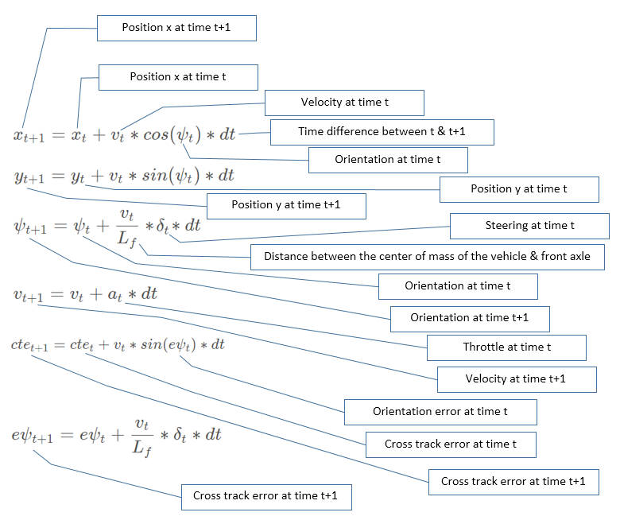

# Project: Model Predictive Control (MPC)
## Overview
This project is about using [Model Predictive Control (MPC)](https://en.wikipedia.org/wiki/Model_predictive_control) for controlling car steering angle & throttle.


## How Does It Work?

The MPC reframes the task of following a trajectory to an optimization problem by finding the best combination of steering angle & throttle values . The MPC is fed the initial state of the car [position, orientation, velocity, cross track error, orientation error]. Using the [Kinematic](https://en.wikipedia.org/wiki/Kinematics) vehicle model, actuator limitations and a cost funcion, the MPC then predicts the best possible actuator inputs (steering & throttle) by finding the lowest cost trajectory. 

## Rubric Points

### The Model

The MPC is based on the global Kinematic Model that is a simple real-time model easily applicable to different types of vehicle and accuracy wise is as good as its complex counterparts. It uses the current state of the car [position, orientation, velocity, cross track error, orientation error] and the actuator values [steering angle, throttle] for making future state & actuator predictions. Below are the equations that define the model:



Following steps illustrate the workings of the MPC:

1. Transform waypoints (provided by the simulator) from global co-ordinate system to vehicle co-ordinate system.
2. Fit a polynomial of order 3 to the transformed waypoints.
3. Calculate initial cross track & orientation errors.
4. Get the state after 100 ms & use the calculated state as current state to account for actuator latency.
5. Call the MPC solver.
6. Get the computed actuator values & the MPC predicted trajectory.  


### Describe how the final hyper parameters were chosen.

I started by implementing Twiddle for the steering angle PID controller’s parameters (tau). I first tried by optimizing all 3 parameters with the default throttle of `0.3`. However, this didn’t work as the car would crash within few seconds. Then the throttle was reduced to `0.1` as there’s not enough straight track for the Twiddle to converge. However, that still didn’t work. Based on the lessons, I changed the order of parameter optimization so that the order is [P,D,I] but it seemed like the I parameter was causing the car to crash quite early on. It could be that the required I parameter value was very small but Twiddle started off with 1 and required considerable amount of steps (reporting of CTE by the simulator, calculating the steering angle & sending the calculated angle back to the simulator = 1 step). Consequently, only the P & D parameters were kept for optimization (I was kept as `0`).The optimization seemed to generate some viable values for P & D but only for throttle below `0.2`. It is important to mention that I configured the Twiddle to run continuously if the Twiddle error is above a threshold or the CTE is above `0.0029` (observed value when the car is going straight without oscillating).

Having spent a lot of time trying to use Twiddle for parameter optimization, I decided to manually tune the parameters by resorting to use the values introduced in the lesson as the starting point (`P=0.2,D=3.0,I=0.004`). I used the *extreme angle count* as a statistic to gauge *ride smoothness*. Below is a summary of the results:

| P | D | I | Extreme Angle count     		| 
|:---:|:---:|:---:|:---:| 			
| 0.2 | 3.0 | 0.004 | 7 |
| 0.4 | 6.0 | 0.004 | 27 |
| 0.6 | 9.0 | 0.004 | 88 |
| 0.2 | 6.0 | 0.004 | 18 |
| 0.2 | 4.0 | 0.004 | 11 |


I kept the I constant `0.004` in the start and concentrated on optimizing P & D. Further, I kept the same ratio (`1:15`) to begin with. Generally, increasing the parameters’ size resulted in roughly exponential increase in extreme angles. On the other hand, just increasing P or D resulted in more extreme angles. However, in case of P it made the car slow to respond when encountered with curves. Also, decreasing P or D in the same ratio, made the car very slow to correct itself, e.g. with a setting of `P=0.1` & `D=1.5`, the crashed straightaway. Similarly, decreasing D from `3` to `2.0` & `1.5` resulted in very slow correction, leading to a crash. In the end, I settled for `P=0.2` & `D=4.0`.

Next, I looked into optimizing the I value by keeping P & D constant (`0.2` & `4.0`). Setting I to `0` from `0.004`caused the car to go very slow, which is suggestive of large CTE. The results of other tested values for I are listed below:

| P | D | I | Description   		| 
|:---:|:---:|:---:|:-------------------------------| 			
| 0.2 | 4.0 | 0.1 |Too much correction, straightaway crash|
| 0.2 | 4.0 | 0.01 |A bit better but still crashed|
| 0.2 | 4.0 | 0.001 |Worked but extreme correction & slow to react i.e. touched the edges few times but no crash|
| 0.2 | 4.0 | 0.0001 |Worked with fewer extreme angles but a bit slow to correct on curves|
| 0.2 | 4.0 | 0.0005 |Still hitting the curb|
| 0.2 | 4.0 | 0.005 |Much better but extreme angles increased to 30|
| 0.2 | 4.0 | 0.003 |Same as 0.0004|
| 0.2 | 4.0 | 0.007 |Hitting the curb quite early on|

## Dependencies

* cmake >= 3.5
 * All OSes: [click here for installation instructions](https://cmake.org/install/)
* make >= 4.1(mac, linux), 3.81(Windows)
  * Linux: make is installed by default on most Linux distros
  * Mac: [install Xcode command line tools to get make](https://developer.apple.com/xcode/features/)
  * Windows: [Click here for installation instructions](http://gnuwin32.sourceforge.net/packages/make.htm)
* gcc/g++ >= 5.4
  * Linux: gcc / g++ is installed by default on most Linux distros
  * Mac: same deal as make - [install Xcode command line tools]((https://developer.apple.com/xcode/features/)
  * Windows: recommend using [MinGW](http://www.mingw.org/)
* [uWebSockets](https://github.com/uWebSockets/uWebSockets)
  * Run either `install-mac.sh` or `install-ubuntu.sh`.
  * If you install from source, checkout to commit `e94b6e1`, i.e.
    ```
    git clone https://github.com/uWebSockets/uWebSockets
    cd uWebSockets
    git checkout e94b6e1
    ```
    Some function signatures have changed in v0.14.x. See [this PR](https://github.com/udacity/CarND-MPC-Project/pull/3) for more details.

* **Ipopt and CppAD:** Please refer to [this document](https://github.com/udacity/CarND-MPC-Project/blob/master/install_Ipopt_CppAD.md) for installation instructions.
* [Eigen](http://eigen.tuxfamily.org/index.php?title=Main_Page). This is already part of the repo so you shouldn't have to worry about it.
* Simulator. You can download these from the [releases tab](https://github.com/udacity/self-driving-car-sim/releases).
* Not a dependency but read the [DATA.md](./DATA.md) for a description of the data sent back from the simulator.


## Basic Build Instructions

1. Clone this repo.
2. Make a build directory: `mkdir build && cd build`
3. Compile: `cmake .. && make`
4. Run it: `./mpc`.
